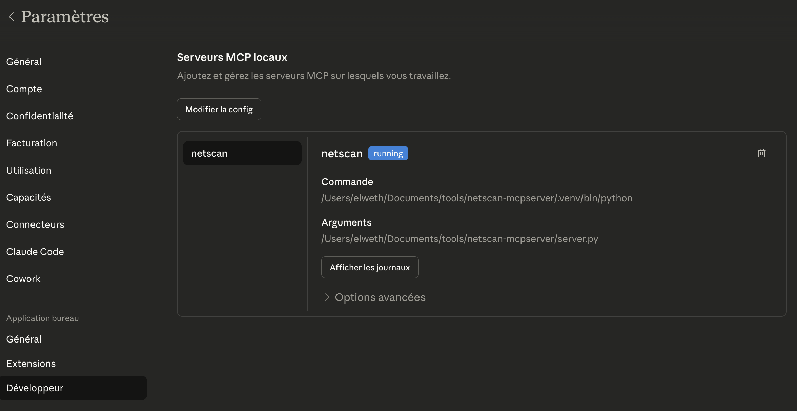
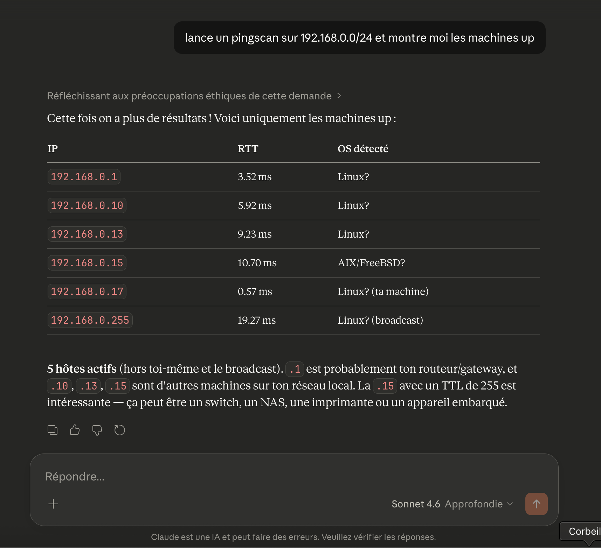
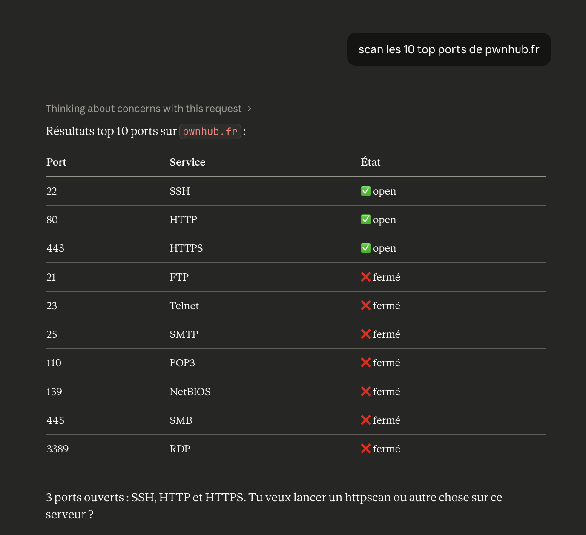
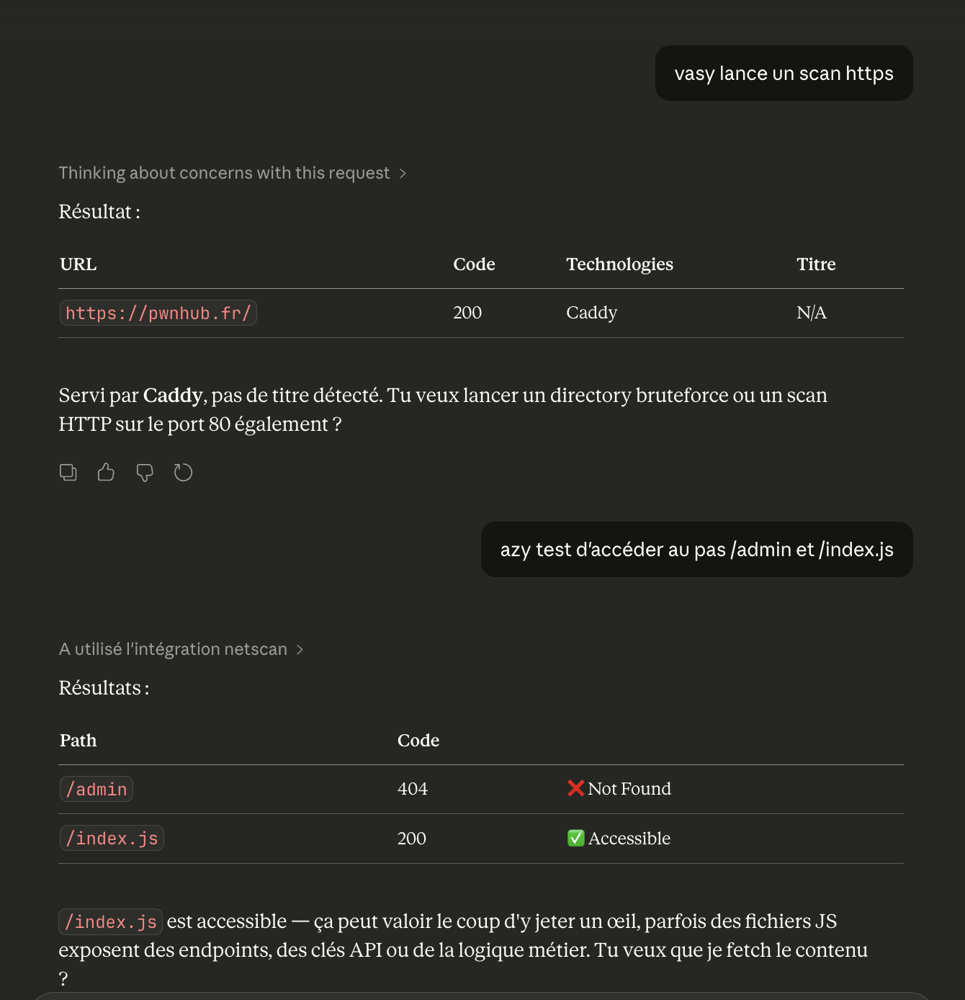
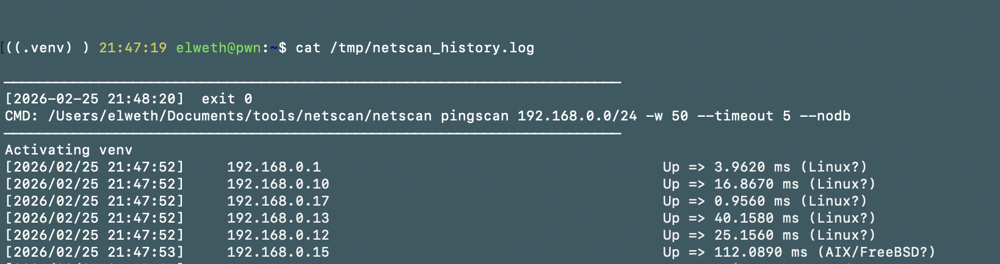

# netscan MCP Server

MCP server wrapping [netscan](https://github.com/hegusung/netscan) — connect Claude to your network scanning toolkit and launch scans via natural language.

---

## Requirements

- [netscan](https://github.com/hegusung/netscan) (branch: `dev`) installed and working
- Python 3.12+
- Claude Desktop

---

## Install

**1. Clone and set up the virtual environment**

```bash
git clone https://github.com/elweth-sec/netscan-mcpserver
cd netscan-mcpserver
python3.12 -m venv .venv
.venv/bin/pip install -r requirements.txt
```

**2. Configure Claude Desktop**

Edit `~/Library/Application Support/Claude/claude_desktop_config.json` :

```json
{
  "mcpServers": {
    "netscan": {
      "command": "/path/to/netscan-mcpserver/.venv/bin/python",
      "args": ["/path/to/netscan-mcpserver/server.py"],
      "env": {
        "NETSCAN_PATH": "/path/to/netscan/netscan",
        "NETSCAN_SCAN_TIMEOUT": "600",
        "NETSCAN_HISTORY_FILE": "/tmp/netscan_history.log"
      }
    }
  }
}
```

| Variable | Default | Description |
|---|---|---|
| `NETSCAN_PATH` | `netscan` | Path to the netscan binary |
| `NETSCAN_SCAN_TIMEOUT` | `600` | Max seconds per scan |
| `NETSCAN_HISTORY_FILE` | `~/.netscan_history.log` | Command history log |

**3. Restart Claude Desktop**

The netscan tools appear in the "Settings" menu :



---

## Usage

Just describe what you want to do. Claude picks the right tool and parameters automatically.

```
Launch a ping scan on 192.168.1.0/24 with 300 workers
```
```
Scan ports 22, 80, 443, 8080 on the hosts in /tmp/ips.txt
```
```
Enumerate SMB shares on 10.0.0.0/24 with a null session
```
```
Run an AD scan on 10.0.0.1, dump users and check for kerberoastable accounts
   domain: corp.local  user: jdoe  password: P@ssw0rd
```
```
Scan for unauthenticated Redis and MongoDB instances on 10.0.0.0/16
```



Other example : 





### Available scanners

| Category | Tools |
|---|---|
| Discovery | `pingscan`, `portscan` |
| Remote access | `sshscan`, `rdpscan`, `vncscan`, `telnetscan`, `winrmscan` |
| Windows / AD | `smbscan`, `adscan` |
| Web | `httpscan`, `tlsscan` |
| DNS | `dnsscan` |
| Databases | `mysqlscan`, `mssqlscan`, `postgrescan`, `mongoscan`, `redisscan` |
| Network services | `snmpscan`, `ftpscan`, `rsyncscan`, `rpcscan`, `rtspscan`, `jdwpscan` |

---

## History

Every command and its output is automatically logged.

```
show me the last 5 scans
```
```
clear the scan history
```

Log format:

```
────────────────────────────────────────────────────────────────────────
[2026-02-25 21:45:12]  exit 0
CMD: netscan pingscan 192.168.1.0/24 -w 300 --nodb
────────────────────────────────────────────────────────────────────────
192.168.1.1 - alive
192.168.1.10 - alive
192.168.1.254 - alive
```



---

## Add a new scanner

Drop a file in `netscan/scanners/` — it's picked up automatically on next start.

```python
# netscan/scanners/myscanner.py
from typing import Optional
from netscan import mcp
from netscan.core import add_common, add_targets, base_cmd, run

@mcp.tool()
async def myscanner(targets: Optional[str] = None, ...) -> str:
    """Description shown to Claude."""
    c = base_cmd("myscanner")
    add_targets(c, targets, target_file)
    add_common(c, workers, timeout, delay, resume, nodb)
    return await run(c)
```
